# Manage Your Work (MYW)

Manage Your Work (MYW) is a basic CRM application that allows users to manage projects, clients, and tasks with role-based access control.

## Built with the tools and technologies:


## 🚀 Functionality
- Responsive design
- User authentication
- User authorization
- Role-based actions
- Full CRUD operations

## ✨ Features
- Secure login and registration system
- Role-based dashboards (Admin / User)
- Project and client management
- Task tracking with status updates
- Clean and intuitive UI using Material UI

## 📸 Screenshots

## Authentication
### Login Form
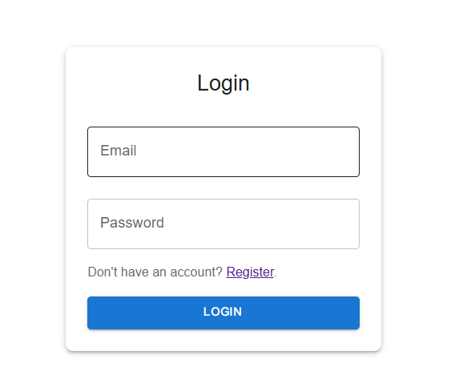

### Register Form
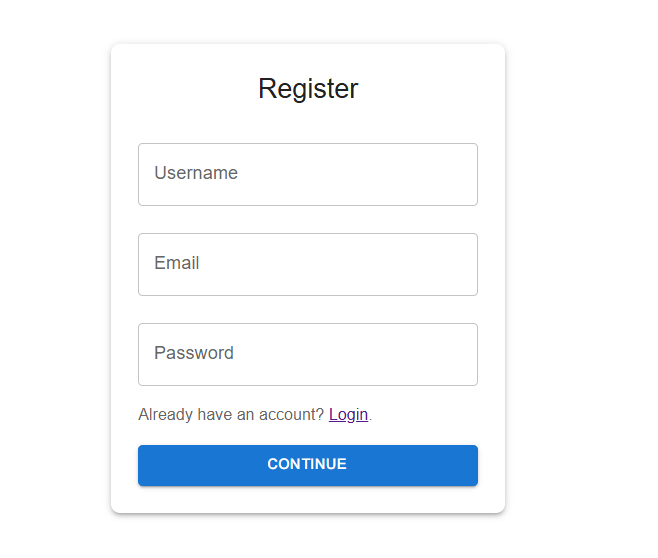

### User view

### Home Page
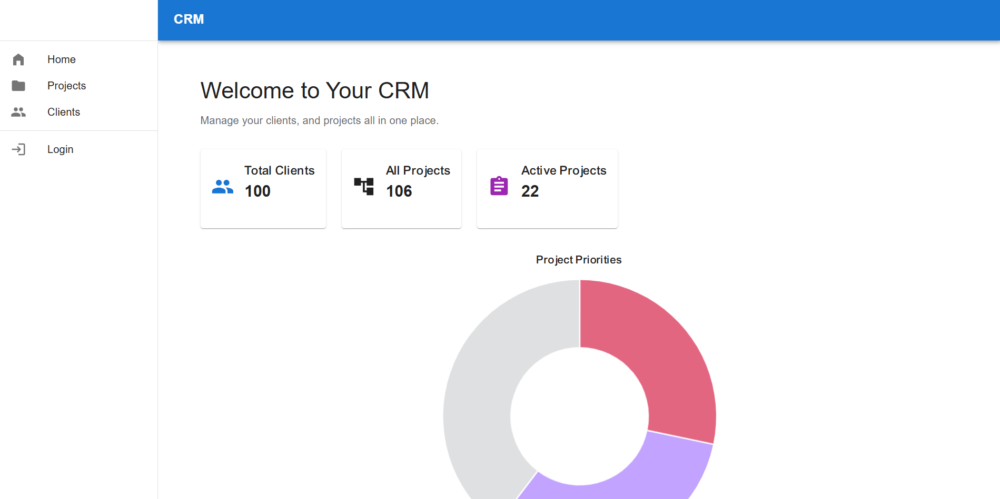

### Projects Page
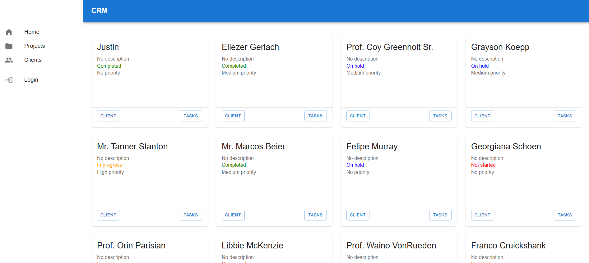

### Tasks Page
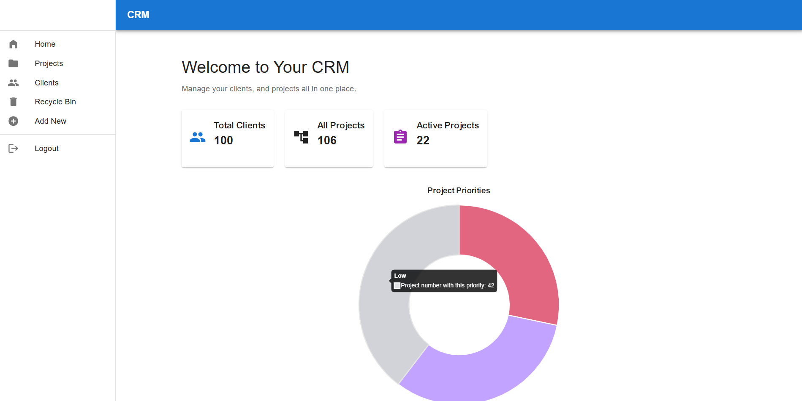

### Clients Page
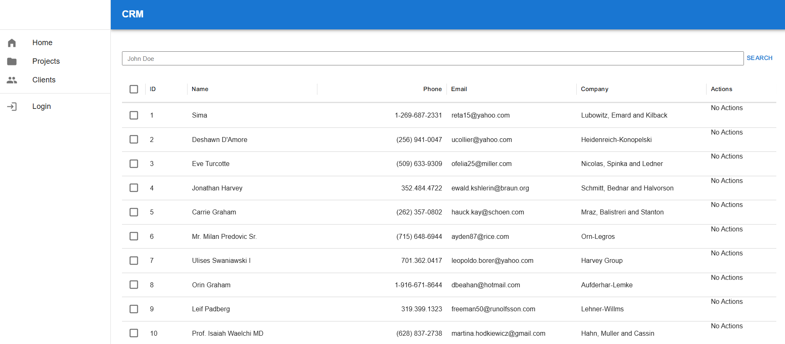

### Client detials 
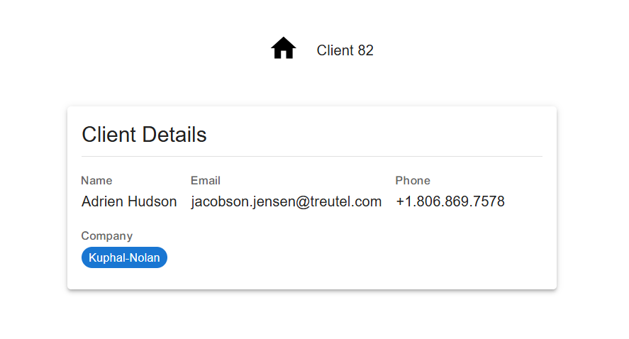

### Charts

### Doughnut chart 
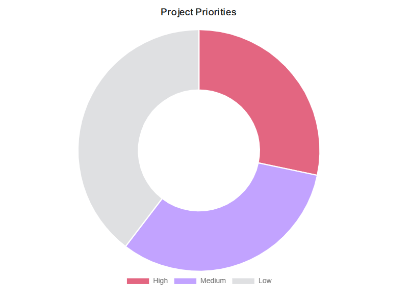

### Line chart 
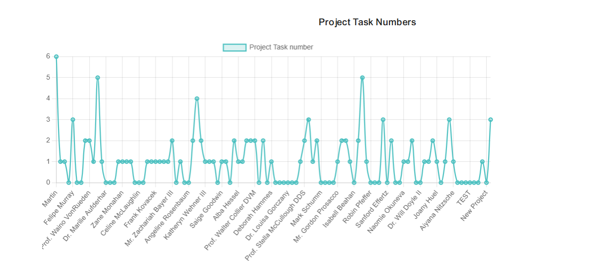

### Bar chart 
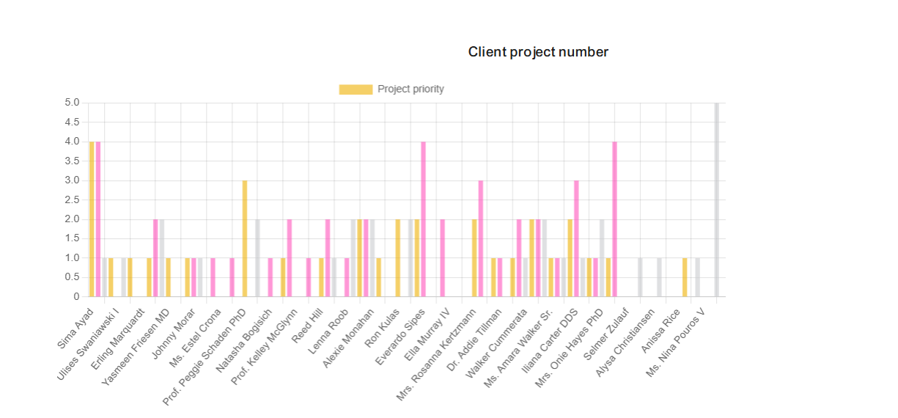

## Admin view in the system

### Admin Home Page view
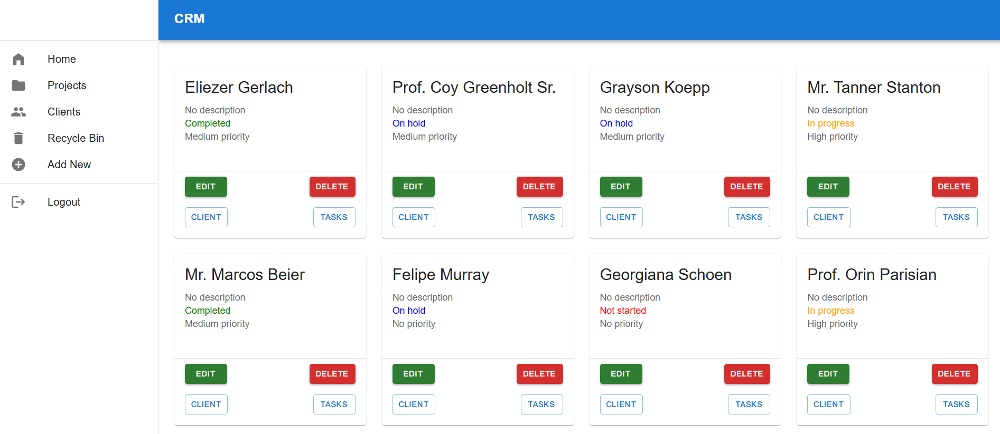

### Project Page
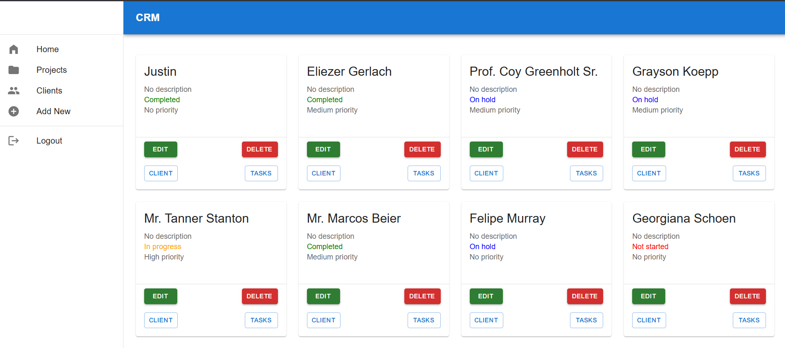

### Clients Page
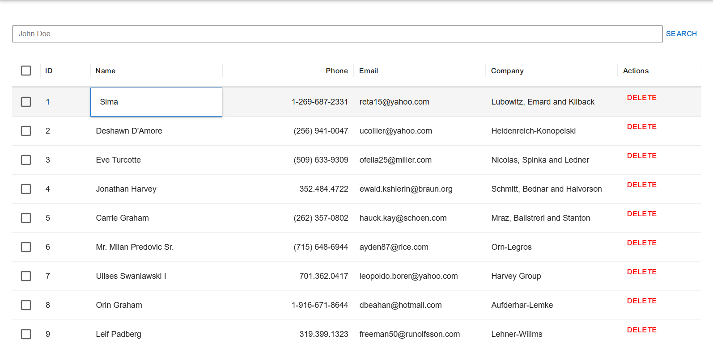

### Recycle Bin Page
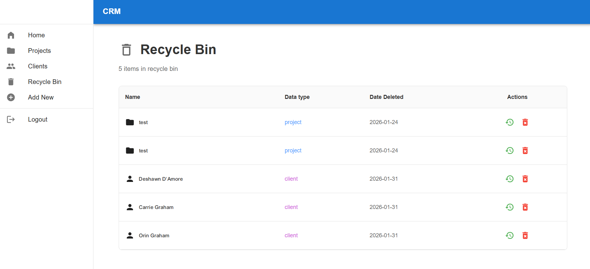

### Add new task page
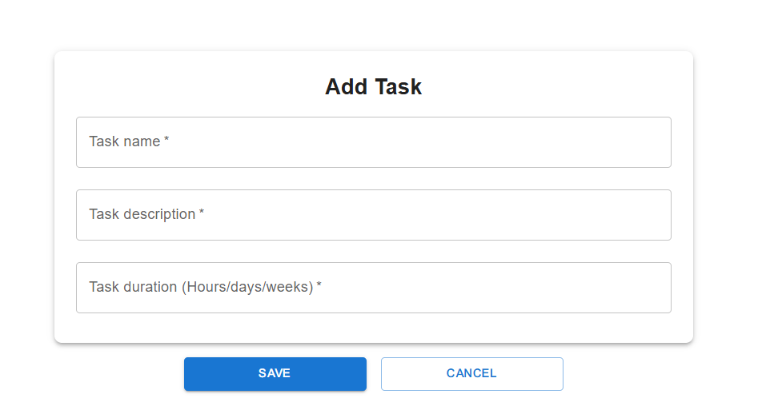

### Add new Project/Client page
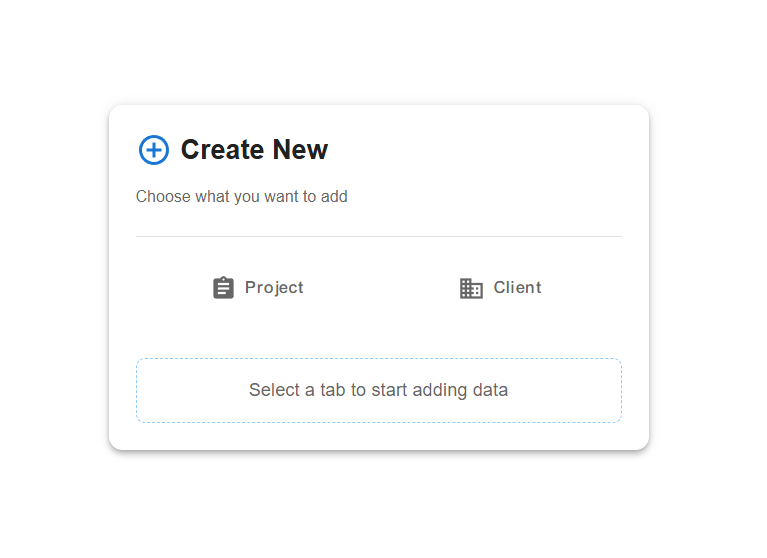

### Add project form
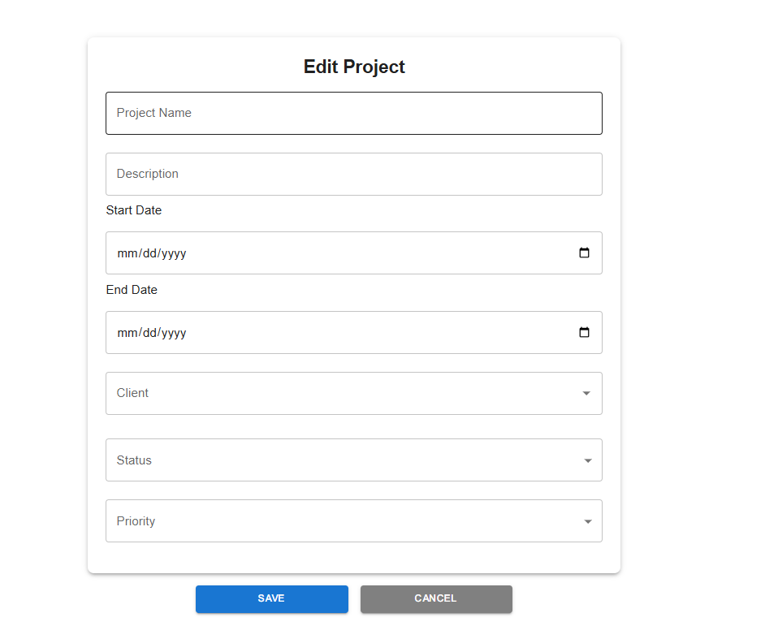

### Add client form
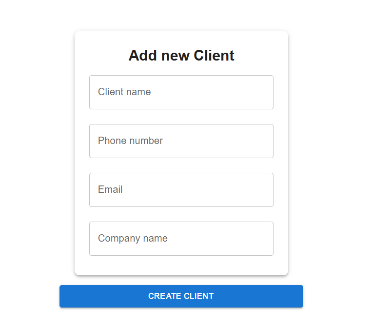

## 📁 Folder Structure
```
src/
├── components/   # Reusable UI components
├── context/      # Authentication context used across the application
├── pages/        # Main application pages (Login, Projects, Clients, etc.)
├── api/          # Backend API endpoints and Axios requests
└── App.jsx       # Application root component
```

## Prerequisites
Make sure to have the following installed:
- Node.js
- Git
- npm

## ⚙️ Installation 
Clone the repository 
```
git clone https://github.com/your-username/your-repo-name.git
cd your-repo-name
```

Navigate to the folder and install dependencies 
```
cd crm
npm install
```

Start react project
```
npm run dev
```

## 👤 Author

**Shya Ayad**  
Junior Fullstack Developer  

Email: [shyaayad1@gmail.com](mailto:shyaayad1@gmail.com)  
[LinkedIn](https://www.linkedin.com/in/shya-ayad-b823362b7) | [GitHub](https://github.com/ShyaAyad)
